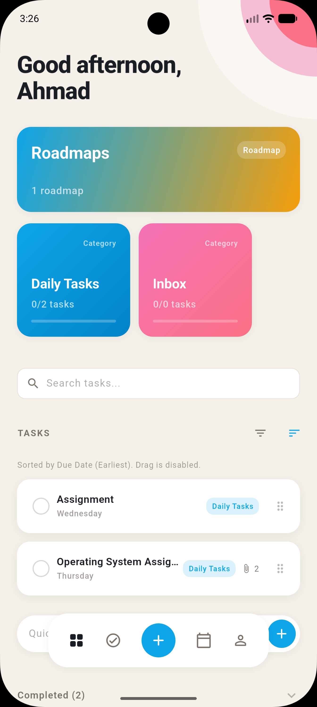
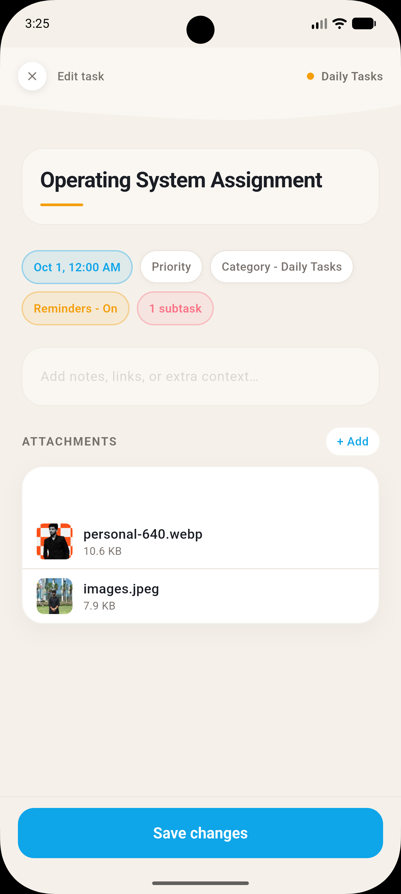

# Todow
Todow is a productivity based mobile application for students that brings your schedule and tasks into one place to help students stay organized.
Todow solves the common student problem of juggling assignments and deadlines across too many platforms. Missing a due date happens too easily, which can cause a chain reaction of stress and falling behind.

## Features

### Completed
- **Task Management** Create, edit, complete, reopen, delete, archive. Includes title, description, priority, start/due dates, tags, and subtasks. Search, filter, and sort. Quick duplicate. Clone recurring tasks. Drag to reorder, swipe to act, and double tap to insert.
- **Reminders & Alerts** Set multiple custom relative/absolute reminders per task, use intelligent presets (Normal, Assignment, Critical), or set a daily recurring reminder for a task. For high-stakes deadlines, flip on the Constant Reminder to relentlessly ping you until you actually finish the task.
- **Attachments** Attach local images, PDFs, and files.
- **Dashboard & Task Creation** Review your day from the dashboard and create tasks with their details in one focused form.

### In Progress
- **Today View** Aggregates overdue, today's, upcoming, active reminders, timetable entries, and active focus sessions.

### Future Roadmap
- **Focus Mode** Task-linked sessions, timer, pause/resume/end, presets, and basic distraction controls.
- **Timetable** Manual entry, CSV import, and OCR image import.
- **Roadmap** Goals, milestones, and priorities with CSV import/export.
- **Google Accounts** Multiple accounts, Gmail to tasks, and Google Calendar sync.
- **Academic Tools** Import Google Classroom assignments, attach Google Drive files, and pull timetable data.
- **Sync & Backup** Sync across devices, automatic backups, and offline changes supported.
- **Focus Improvements** Android app blocking, allowed apps during study, and focus history.
- **Advanced Planning** Recurring tasks, weekly/monthly planning, goal tracking, milestone dependencies, and flexible reminder rules.

Everything is stored locally on your device.

## Setup

```bash
flutter pub get
flutter run
```

Run tests:

```bash
flutter test
flutter analyze
```

## Docs

- [Product spec](docs/PRODUCT.md)
- [Architecture](docs/ARCHITECTURE.md)
- [Design spec](docs/DESIGN_SPEC.md)
- [User flows](docs/FLOWS.md)
- [Roadmap](docs/ROADMAP.md)

## Screenshots

The screenshots below show the current app build.

| Dashboard | Create task |
| --- | --- |
|  |  |
