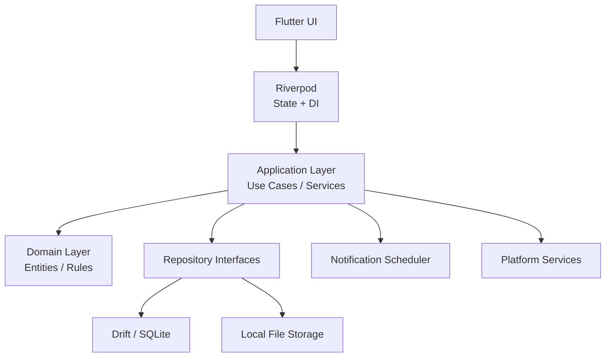

# Application Architecture

## Architecture Style
**Feature-first layered architecture** combining Riverpod state management, domain models, application services, repository interfaces, and SQLite persistence through Drift.

```text
Presentation (Flutter UI)
    ↓
Riverpod (State + DI)
    ↓
Application (Use Cases / Services)
    ↓
Domain (Entities / Value Objects / Rules)
    ↓
Data / Infrastructure (Repositories / SQLite / Drift / Notifications)
```

## Decisions & ADRs
1. **Riverpod**: Used for dependency injection and observable state. **Constraint**: Do not place business logic in Riverpod providers.
2. **SQLite + Drift**: Persistence engine. **Constraint**: Application/Domain layers must not depend directly on Drift APIs.
3. **Local-first MVP**: MVP operates without auth or cloud. Future integrations use adapters.
4. **Human Review**: Imported data (CSV/OCR) always creates a draft that must be reviewed and confirmed before persistence.

## State Management
- **Persistent state** (SQLite): tasks, reminders, timetable, roadmaps, focus sessions.
- **Ephemeral UI state** (Riverpod/UI): selected filters, active tabs, import drafts, form values.
- **Domain state**: Represented by pure entities/value objects, not arbitrary widgets.

## Domain Model
- **Task**: Contains Subtasks, Attachments, Reminders, Focus Sessions.
- **Reminder**: Contains `taskId`, `scheduledAt`, `status`, `snoozeUntil`.
- **FocusSession**: Task-linked duration session.
- **TimetableEntry / TimetableDraftEntry**: A University class or Personal activity. Entries store schedule scope, recurrence/date, and an optional task link. CSV, Excel, and OCR drafts stay in presentation memory until validated and confirmed; one repository transaction persists a confirmed batch.
- **Roadmap / Milestone**: Long-term goal tracking.

## System Diagram




## Implementation Rules
1. Do not implement features outside the current MVP.
2. Do not bypass domain/application boundaries for convenience.
3. Do not place business logic inside widgets or SQL inside presentation code.
4. Reuse existing infrastructure before creating new.
