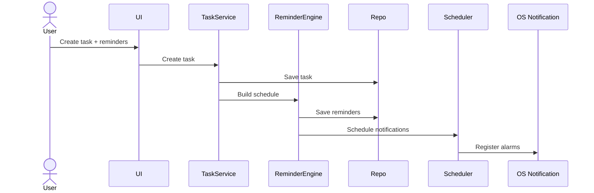

# Application Flows

## Reminder Flow

### Scheduling




### Reliability Rules
The scheduler must be reconstructable from persistent state. On application startup:
1. Load active tasks & pending reminders.
2. Detect expired/stale schedules.
3. Reconcile and schedule missing notifications.
4. Cancel notifications for completed/cancelled tasks.

## Timetable Import Flow

### Architecture


```text
UNIVERSITY OR PERSONAL SCHEDULE
      ↓
Manual entry OR CSV / Excel parser OR camera / gallery OCR
      ↓
Editable timetable draft
      ↓
Review course, instructor, room, weekday, start and end time
      ↓
Validate every row
      ↓
Confirm
      ↓
Persist the full import in one SQLite transaction
```

University manual entries use a recurring weekly model. Personal entries can repeat weekly or use a selected date and can link to an existing task. Copying university classes makes independent personal entries. Tasks, including roadmap tasks, can be scheduled into Personal; a personal activity can create its linked task. CSV and Excel imports use the columns `course,instructor,day,start_time,end_time,room` and parse deterministically. OCR tries up to three scans for an image; after the third failure the user can try a different image, import CSV/Excel, or copy an optional prompt for an external assistant. No import writes to SQLite before confirmation. If any confirmed row fails to save, the transaction rolls back the whole import.
