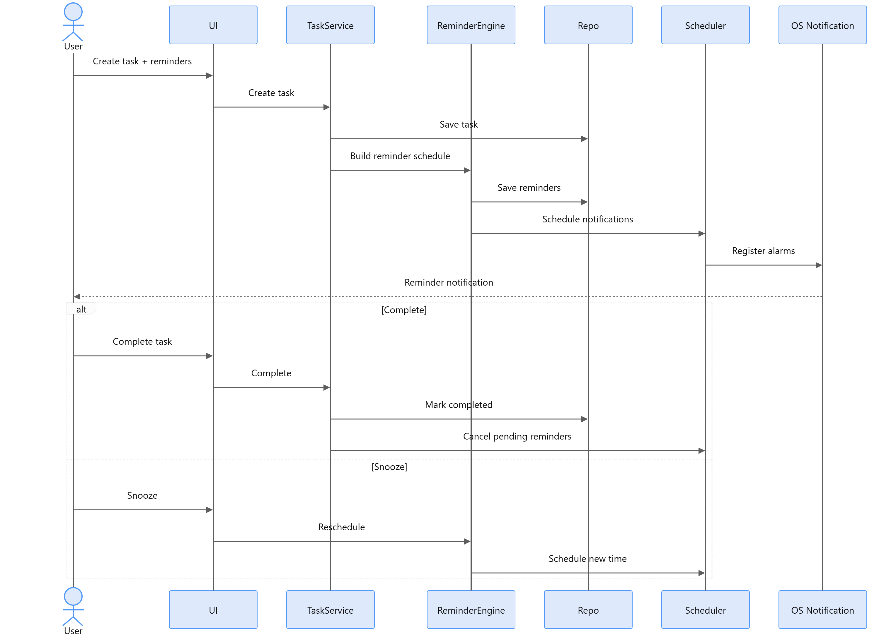
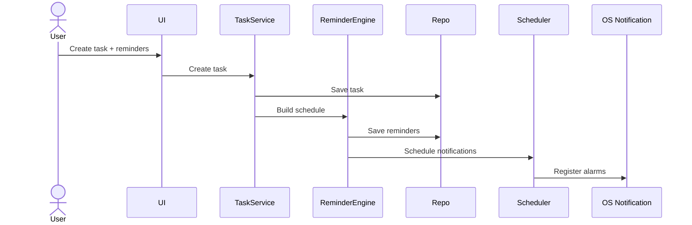

# Application Flows

## Reminder Flow

### Scheduling





### Reliability Rules
The scheduler must be reconstructable from persistent state. On application startup:
1. Load active tasks & pending reminders.
2. Detect expired/stale schedules.
3. Reconcile and schedule missing notifications.
4. Cancel notifications for completed/cancelled tasks.

## Timetable Import Flow

### Architecture


```text
TIMETABLE INPUT (Manual / CSV / OCR Image)
      ↓
Parser / Extraction
      ↓
Timetable Draft
      ↓
Review / Edit by User
      ↓
Validation
      ↓
Confirm
      ↓
Persistence (SQLite)
```

Ambiguous OCR/CSV data should be surfaced to the user. Nothing is saved until confirmed.
